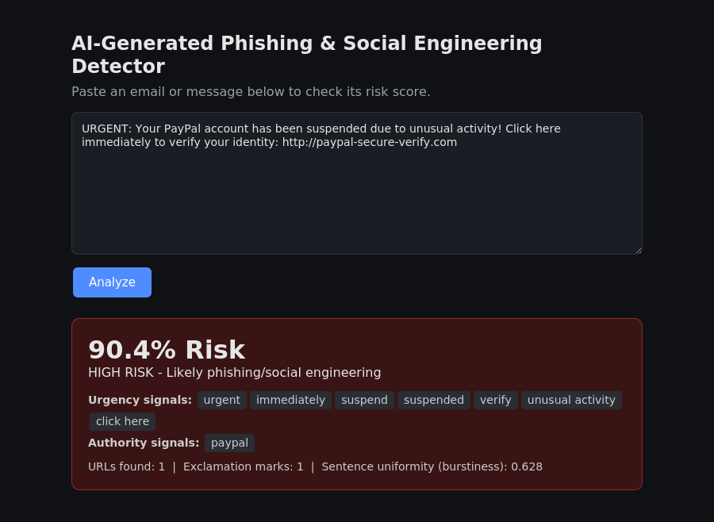

# AI-Generated Phishing & Deepfake Detection System

An AI-based system that detects phishing and AI-generated social engineering
content — not just by checking for bad grammar or suspicious links, but by
analysing the linguistic and behavioural patterns that distinguish AI-written
deceptive messages from genuine ones.

Built as my final year Computer Science project at Federal University Wukari,
Nigeria. The core detection model is complete and tested; the mobile app and
the secondary voice/deepfake component are still in progress (see
[Status](#status) below).



## Why this project

Traditional phishing filters look for old-style mistakes — spelling errors,
generic greetings, obviously fake links. Large language models have made it
trivial to write phishing emails with none of those flaws. Research shows
commercial filters can miss the majority of AI-generated phishing as a
result. This project is my attempt at a lightweight, explainable detector
that looks at *how* a message is written, not just its surface features.

## Features

- **Risk scoring** — returns a 0–100% risk score for any pasted message, not
  just a binary "safe/unsafe" label
- **Explainable output** — flags the specific urgency, authority, and
  financial-pressure words that triggered the score, so the result isn't a
  black box
- **Combined feature set** — TF-IDF text patterns (3,000 features, unigrams +
  bigrams) plus 11 hand-engineered linguistic features (urgency/authority/
  financial word counts, punctuation, sentence-length "burstiness" as a
  proxy for AI-generated text uniformity)
- **REST API** — a Flask backend (`/api/analyze`) that any client can call
- **Web interface** — a simple browser UI for testing messages directly
- **Mobile app (in progress)** — a Flutter client that calls the same API

## Tech stack

| Layer | Technology |
|---|---|
| Model | scikit-learn Random Forest (200 estimators, max depth 30) |
| Feature engineering | TF-IDF (scikit-learn), custom linguistic feature extraction |
| Backend | Flask, Flask-CORS |
| Web frontend | HTML/CSS/JavaScript |
| Mobile frontend | Flutter/Dart |
| Data handling | pandas, NumPy, SciPy, joblib |

## Dataset

Trained on the [Enron Spam dataset](https://github.com/MWiechmann/enron_spam_data),
a public, labelled collection of real email correspondence. A balanced
subset of 16,000 emails (8,000 spam/phishing, 8,000 legitimate) was used for
training, with an 80:20 stratified train/test split. The full raw dataset
(~50MB) is not committed to this repository; a 500-row sample is included
under `data/` for reference, and `src/train_model.py` will train against the
full dataset if you supply it.

## Results

Evaluated on a held-out test set of 3,200 emails the model had never seen:

| Metric | Legitimate | Phishing/Spam |
|---|---|---|
| Precision | 1.00 | 0.94 |
| Recall | 0.94 | 1.00 |
| F1-score | 0.97 | 0.97 |

**Overall accuracy: 96.8%**

These are real, measured results from `src/train_model.py`'s evaluation
step — not projected figures.

## Project structure

```
ai-phishing-deepfake-detector/
├── app/
│   ├── api.py               # Flask REST API (used by the mobile app)
│   ├── app.py                # Flask web app (browser UI)
│   └── templates/index.html  # Web UI template
├── src/
│   ├── train_model.py        # Feature engineering + model training
│   └── predict.py            # Scoring/inference logic
├── mobile_app/                # Flutter mobile app (in progress)
├── models/                    # Pre-trained model files (ready to use)
├── data/                      # Sample training data
├── tests/
│   └── test_detector.py       # Feature extraction + prediction tests
├── docs/screenshots/           # App screenshots
├── requirements.txt
└── LICENSE
```

## Getting started

### Prerequisites
- Python 3.10+
- pip

### Installation

```bash
git clone https://github.com/JoelAJ01/ai-phishing-deepfake-detector.git
cd ai-phishing-deepfake-detector
pip install -r requirements.txt
```

### Run the web app

```bash
cd app
python app.py
```

Open `http://127.0.0.1:5000` in your browser, paste a message, and click
Analyze.

### Run the API only

```bash
cd app
python api.py
```

Test it:

```bash
curl -X POST http://127.0.0.1:5000/api/analyze \
  -H "Content-Type: application/json" \
  -d '{"message":"URGENT click here now to verify your account"}'
```

### Run the tests

```bash
python tests/test_detector.py
```

### Retrain the model

The pre-trained model is already included under `models/`, so retraining is
optional. To retrain from scratch (e.g. on a different dataset):

```bash
cd src
python train_model.py
```

## Status

This is an active, in-progress student project, not a finished product.

**Done:**
- [x] Dataset preprocessing and feature engineering
- [x] Random Forest model trained and evaluated (96.8% accuracy)
- [x] Flask REST API
- [x] Web interface
- [x] Automated tests for the detection pipeline

**In progress:**
- [ ] Flutter mobile app (UI built, integration testing ongoing)
- [ ] Secondary voice/deepfake detection component (exploratory, scoped as
      a stretch goal for the final submission)
- [ ] Public deployment of the API (currently local-only)

## Limitations

- Trained on a public, general-purpose spam dataset — not on a curated
  AI-generated-phishing-specific corpus, since no such public dataset is
  widely available yet
- The linguistic "burstiness" feature is a simple statistical proxy for
  AI-generated text uniformity, not a dedicated AI-text detector
- Not evaluated at enterprise scale or against real-time email traffic
- The voice/deepfake component is exploratory and not held to the same
  evaluation standard as the core text model

## Security considerations

- No user data is stored; each request is scored and discarded
- No authentication is currently implemented on the API — this is a local
  development prototype, not a production deployment
- No secrets, API keys, or credentials are included in this repository

## Author

**Agulla Joel Audu**
Computer Science Student, Federal University Wukari, Nigeria
[GitHub](https://github.com/JoelAJ01) · [LinkedIn](https://www.linkedin.com/in/joel-agulla-6047a4346/)

## License

MIT — see [LICENSE](LICENSE).
